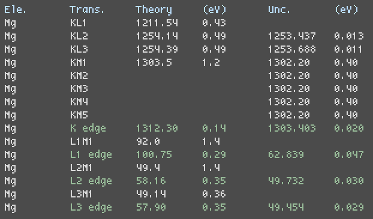

# Xedge
---
<p align="center">

<p/>

Xedge is a simple BASH/AWK script that fetches x-ray transition and shell
edge energies from NIST. References for measurements and theoretical
predictions may be found
[here](https://physics.nist.gov/PhysRefData/XrayTrans/Html/refs.html).

### Usage

```
xedge [element] [--dlg]
```

### Dependencies
* wget
* Linux dialog (for `--dlg` option)
